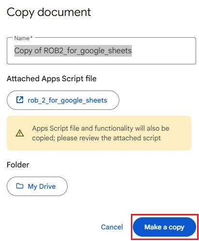

# RoB 2 for Google Sheets

Implementation of RoB 2 risk of bias assessment tool for Google Sheets.

> [!WARNING]
> This implementation of the RoB 2 tool is in the testing phase and has not yet been validated for use. The official source of instructions and tools on risk of bias assessment, from the Cochrane Collaboration, is available only at [www.riskofbias.info](www.riskofbias.info).

> [!NOTE]
> All credit for the development of the RoB 2 tool and its original implementation for Excel spreadsheets belongs to the following authors in the following publications:
>
> Sterne JAC, Savović J, Page MJ, Elbers RG, Blencowe NS, Boutron I, Cates CJ, Cheng H-Y, Corbett MS, Eldridge SM, Hernán MA, Hopewell S, Hróbjartsson A, Junqueira DR, Jüni P,  Kirkham JJ, Lasserson T, Li T, McAleenan A, Reeves BC, Shepperd S, Shrier I, Stewart LA, Tilling K, White IR, Whiting PF, Higgins JPT. RoB 2: a revised tool for assessing risk of bias in randomised trials. BMJ 2019; 366: l4898.
>
> Higgins JPT, Sterne JAC, Savović J, Page MJ, Hróbjartsson A, Boutron I, Reeves B, Eldridge S. A revised tool for assessing risk of bias in randomized trials In: Chandler J, McKenzie J, Boutron I, Welch V (editors). Cochrane Methods. Cochrane Database of Systematic Reviews 2016, Issue 10 (Suppl 1). dx.doi.org/10.1002/14651858.CD201601.

The implementation of RoB 2 for Google Sheets aims to facilitate and popularize the use of the tool. Access is exclusively through a web browser, and therefore it can be accessed from any computer with internet access and on any operating system, avoiding version incompatibility issues. Sharing is done online and allows simultaneous editing by more than one user, in addition to being able to control who can have access and what type of access (read-only, edit, etc.).

This page will only describe information specific to the use of this particular implementation. For general questions about the RoB 2 tool, please consult the tool's original manual (available at this link: https://drive.google.com/file/d/19R9savfPdCHC8XLz2iiMvL_71lPJERWK/view).

## Table of Contents
- [System and software requirements](#system-and-software-requirements)
- 

## System and software requirements

- Internet access;
- Google account.

## How to use

1. Access the spreadsheet link: https://docs.google.com/spreadsheets/d/1oO5L3sdsczpX9jspHANO0yCoUkvngHV4Ts1vKlF4gjE/edit?usp=sharing

2. Log in to your Google account if you are not already logged in (**Sign in** button)

3. In the **File** menu, in the top left corner of the page, select the **Make a copy** option

4. In the pop-up window, you can choose the name of the spreadsheet and the folder where it will be saved in Google Drive. There is also information that the script file will be copied along with the spreadsheet. This script file is necessary for the tool to function. If you agree, click the button **Make a copy**
