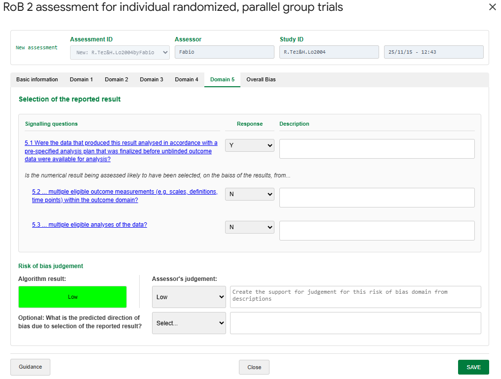
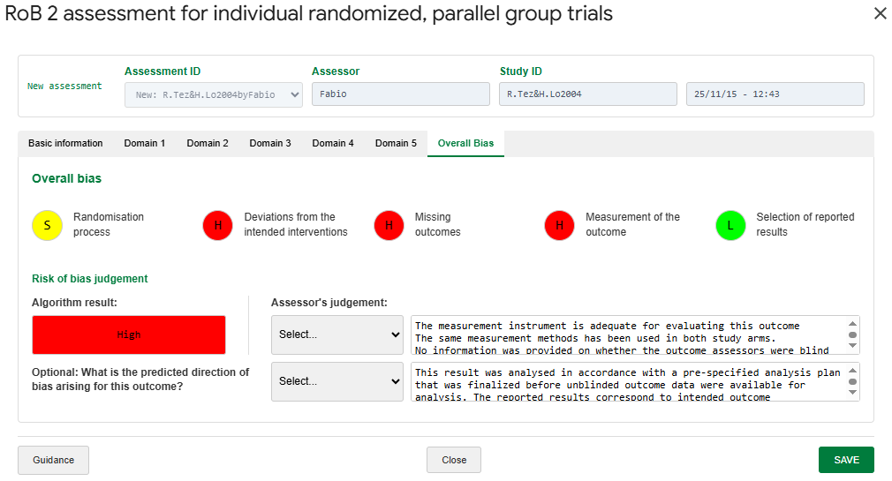
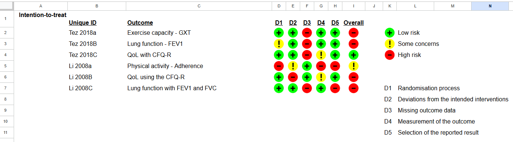
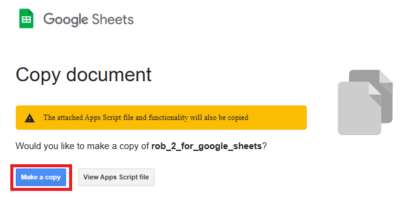
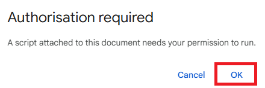
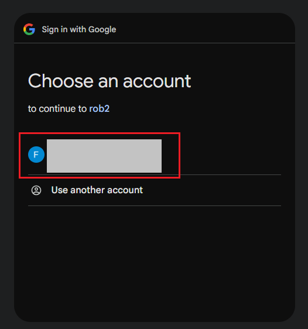
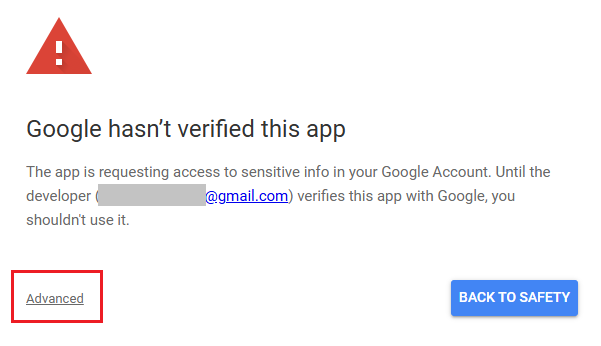
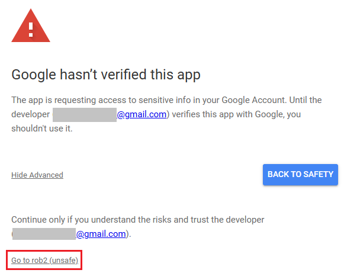
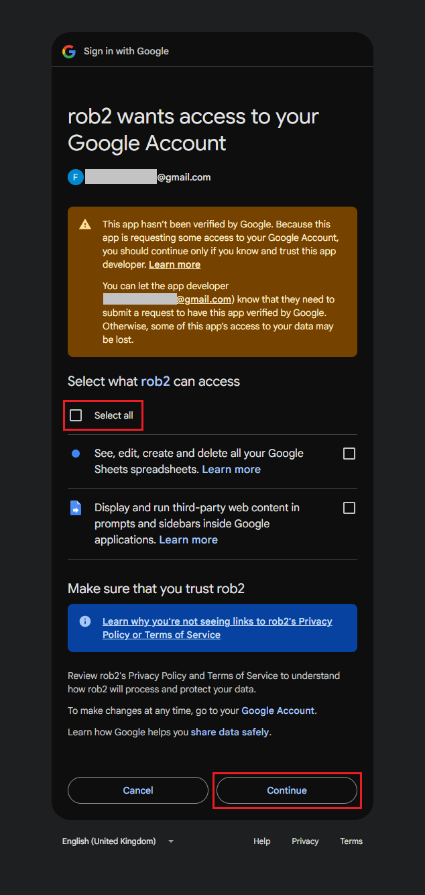

# RoB 2 for Google Sheets

RoB 2 is a tool to assessment the risk of bias in randomized clinical trials developed by the Cochrane Colaboration. The tool was originally implemented using Microsoft Excel spreadsheets and macros. This repository contains a version of the same tool using Google Sheets.

The implementation of RoB 2 for Google Sheets aims to facilitate and popularize the use of the tool. Access is exclusively through a web browser, and therefore it can be accessed from any computer with internet access and on any operating system, avoiding version incompatibility issues. Sharing is done online and allows simultaneous editing by more than one user, in addition to being able to control who can have access and what type of access (read-only, edit, etc.).

This page will only describe information specific to the use of this particular implementation. For general questions about the RoB 2 tool, please consult the tool's original manual (available at this link: https://drive.google.com/file/d/19R9savfPdCHC8XLz2iiMvL_71lPJERWK/view).

> [!WARNING]
> This implementation of the RoB 2 tool is in the testing phase and has not yet been validated for use. The official source of instructions and tools on risk of bias assessment, from the Cochrane Collaboration, is available only at [www.riskofbias.info](www.riskofbias.info).

> [!NOTE]
> All credit for the development of the RoB 2 tool and its original implementation for Excel spreadsheets belongs to the following authors in the following publications:
>
> Sterne JAC, Savović J, Page MJ, Elbers RG, Blencowe NS, Boutron I, Cates CJ, Cheng H-Y, Corbett MS, Eldridge SM, Hernán MA, Hopewell S, Hróbjartsson A, Junqueira DR, Jüni P,  Kirkham JJ, Lasserson T, Li T, McAleenan A, Reeves BC, Shepperd S, Shrier I, Stewart LA, Tilling K, White IR, Whiting PF, Higgins JPT. RoB 2: a revised tool for assessing risk of bias in randomised trials. BMJ 2019; 366: l4898.
>
> Higgins JPT, Sterne JAC, Savović J, Page MJ, Hróbjartsson A, Boutron I, Reeves B, Eldridge S. A revised tool for assessing risk of bias in randomized trials In: Chandler J, McKenzie J, Boutron I, Welch V (editors). Cochrane Methods. Cochrane Database of Systematic Reviews 2016, Issue 10 (Suppl 1). dx.doi.org/10.1002/14651858.CD201601.

## Table of Contents
- [System and software requirements](#system-and-software-requirements)
- [How to use](#how-to-use)
 - [Make a copy of the RoB 2 spreadsheet](#make-a-copy-of-the-rob-2-spreadsheet)
 - [Authorise the execution of the script](#authorise-the-execution-of-the-script)

## System and software requirements

- Internet access;
- Google account.

## How to use

### Make a copy of the RoB 2 spreadsheet

1. Access the spreadsheet link: https://docs.google.com/spreadsheets/d/1ak9kmsB4Zh6xtms7-SZQ4pC7M_Ahi6hobCX81i8L7h0/copy

2. If you have not yet logged into your Google account (Gmail), you will be asked to do so. After logging in (or if you are already logged in), you will be asked to make a copy of the spreadsheet:

> [!NOTE]
> The **View Apps Script file** button displays the source codes used in the spreadsheet (the same as those publicly available in this repository). You can check them if you wish.

When you click on **Make a copy**, you will be directed to your copy of the spreadsheet.

### Authorise the execution of the script

1. When you click for the first time on one of the buttons on the **Intro** tab or on one of the items in the **RoB 2** menu (which are equivalent), you will be asked for your authorisation to run the script that implements the RoB 2 features. This authorisation procedure will only be necessary only in the first time.

2. If you clicked OK in the image above, a new browser tab or window will open asking you to choose the Google account to authorise (there may be one or more accounts currently logged in). Select the account by clicking on it.

3. After selecting your account, a warning message will appear regarding the execution of the script that implements the spreadsheet's features. To proceed, click **Advanced**:

> [!NOTE]
> The warning displayed is a standard message from Google that is displayed for security reasons, similar to the warning displayed before running a Microsoft Excel spreadsheet that contains macros. In this case, there is no reason to worry. The script only accesses the spreadsheet and performs the necessary operations. No other documents or information from your account are collected. The warning only appears by default in all user-customised scripts. To maintain transparency, all source code is publicly available in this repository and can also be viewed in the spreadsheet itself.

4. After clicking Advanced, click **Go to rob2 (unsafe)**:

5. On the next screen, you must select the permissions that the script needs to function correctly. Select the **Select all** checkbox and then click the **Continue** button:

That's it, you now have access to all the spreadsheet's features. Authorisation to run the script is only required on first use.

> [!NOTE]
> At the end of the authorisation process, you will likely receive an automatic email from Google informing you that the script now has access to some of your account data. Again, this is a standard message, and in this case, there is no cause for concern. Google allows users to check which apps have access to their account data at any time and allows users to cancel access at any time.