# RoB 2 for Google Sheets (RoB 2 GS)

Risk of Bias 2 (RoB 2) is a tool, developed by the Cochrane Colaboration, to assessing risk of bias in randomized clinical trials. The tool was originally implemented using Microsoft Excel spreadsheets using VBA macros. This repository contains a version of the same tool using Google Sheets (RoB 2 GS).

RoB 2 GS aims to facilitate and popularize the use of the tool. Access is exclusively through a web browser, and therefore it can be accessed from any computer with internet access and on any operating system, avoiding version incompatibility issues. Sharing is done online and allows simultaneous editing by more than one user, in addition to being able to control who can have access and what type of access (read-only, edit, etc.).

This page will only describe information specific to the use of this particular implementation. For general questions about the RoB 2 tool, please consult the tool's original manual (available at this link: https://drive.google.com/file/d/19R9savfPdCHC8XLz2iiMvL_71lPJERWK/view).

> [!NOTE]
> This implementation of RoB 2 was based on the tool’s original implementation as described in the manuals, publications and the features of the Excel version. The official source of instructions and tools on risk of bias assessment, from the Cochrane Collaboration, is available at [www.riskofbias.info](www.riskofbias.info).

---
Examples of use of RoB 2 GS:
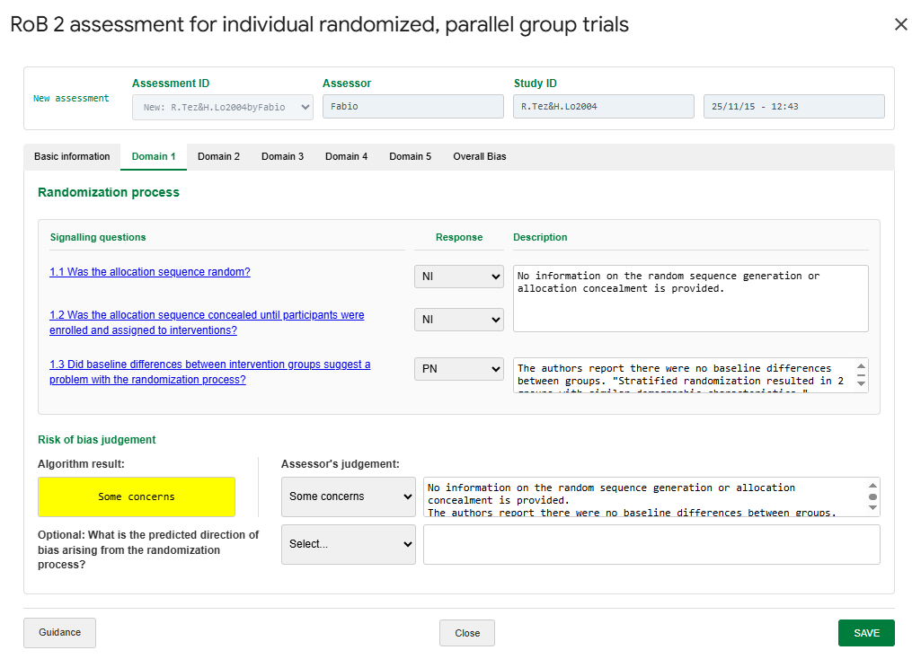

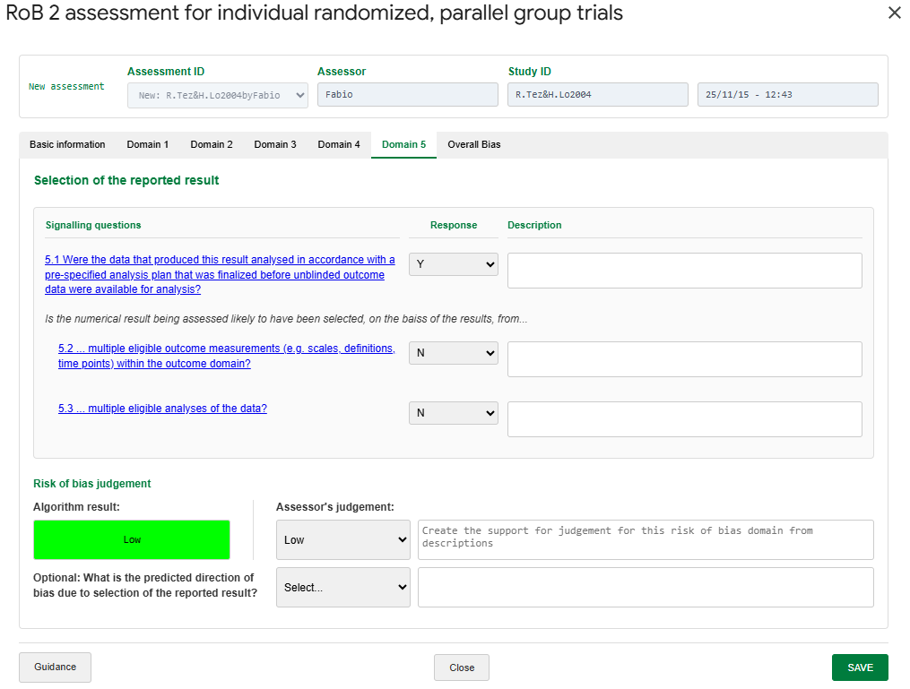

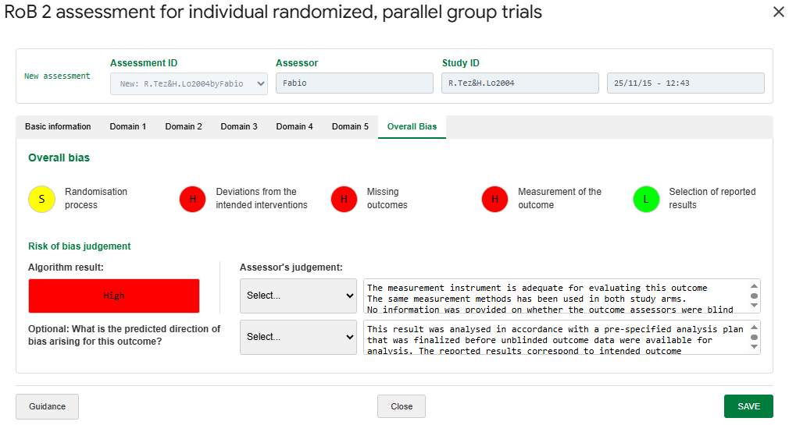

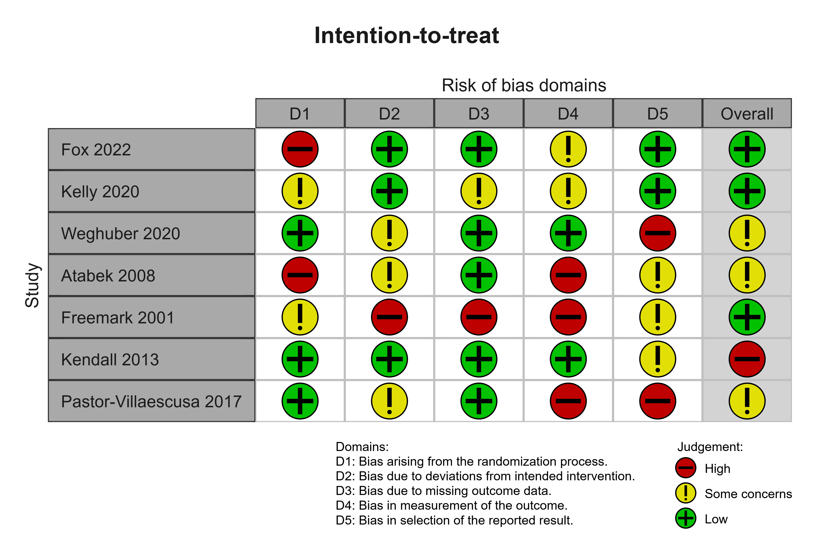

> [!NOTE]
> All credit for the development of the RoB 2 tool and its original implementation for Excel spreadsheets belongs to the following authors in the following publications:
>
> Sterne JAC, Savović J, Page MJ, Elbers RG, Blencowe NS, Boutron I, Cates CJ, Cheng H-Y, Corbett MS, Eldridge SM, Hernán MA, Hopewell S, Hróbjartsson A, Junqueira DR, Jüni P,  Kirkham JJ, Lasserson T, Li T, McAleenan A, Reeves BC, Shepperd S, Shrier I, Stewart LA, Tilling K, White IR, Whiting PF, Higgins JPT. RoB 2: a revised tool for assessing risk of bias in randomised trials. BMJ 2019; 366: l4898.
>
> Higgins JPT, Sterne JAC, Savović J, Page MJ, Hróbjartsson A, Boutron I, Reeves B, Eldridge S. A revised tool for assessing risk of bias in randomized trials In: Chandler J, McKenzie J, Boutron I, Welch V (editors). Cochrane Methods. Cochrane Database of Systematic Reviews 2016, Issue 10 (Suppl 1). dx.doi.org/10.1002/14651858.CD201601.

## Table of Contents
- [System and software requirements](#system-and-software-requirements)
- [How to use](#how-to-use)
  - [Make a copy of the RoB 2 GS](#make-a-copy-of-the-rob-2-spreadsheet)
  - [Authorise the execution of the script](#authorise-the-execution-of-the-script)
  - [Create a new assessment](#create-a-new-assessment)
  - [Editing existing assessments](#editing-existing-assessments)
  - [Deleting an existing assessment](#deleting-an-existing-assessment)
  - [Creating a summary table and risk of bias graph](#creating-a-summary-table-and-risk-of-bias-graph)
    - [Download risk of bias graph](#download-risk-of-bias-graph)
  - [Risk of bias figures](#risk-of-bias-figures)
  - [Populating results for printing](#populating-results-for-printing)
- [License](#license)

## System and software requirements

- Internet access;
- Google account.

## How to use

### Make a copy of the RoB 2 GS

1. Access the spreadsheet link: https://docs.google.com/spreadsheets/d/1ak9kmsB4Zh6xtms7-SZQ4pC7M_Ahi6hobCX81i8L7h0/copy

2. If you have not yet logged into your Google account (Gmail), you will be asked to do so. After logging in (or if you are already logged in), you will be asked to make a copy of the spreadsheet:
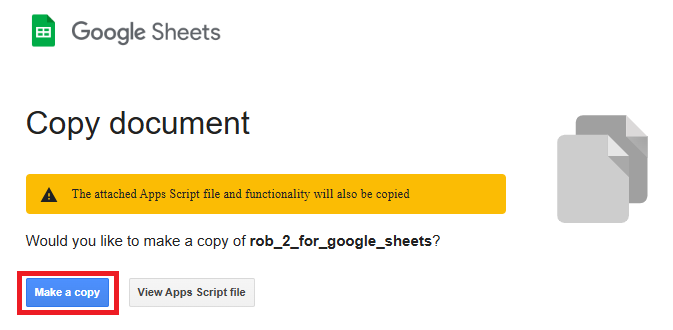

> [!NOTE]
> The **View Apps Script file** button displays the source codes used in the spreadsheet (the same as those publicly available in this repository). You can check them if you wish.

When you click on **Make a copy**, you will be directed to your copy of the spreadsheet.

### Authorise the execution of the script

1. When you click for the first time on one of the buttons on the **Intro** tab or on one of the items in the **RoB 2** menu (which are equivalent), you will be asked for your authorisation to run the script that implements the RoB 2 GS features. This authorisation procedure will only be necessary only in the first time.
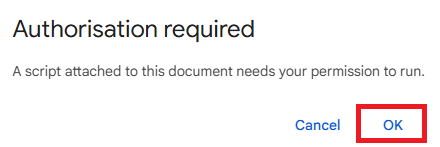

2. If you clicked OK in the image above, a new browser tab or window will open asking you to choose the Google account to authorise (there may be one or more accounts currently logged in). Select the account by clicking on it.
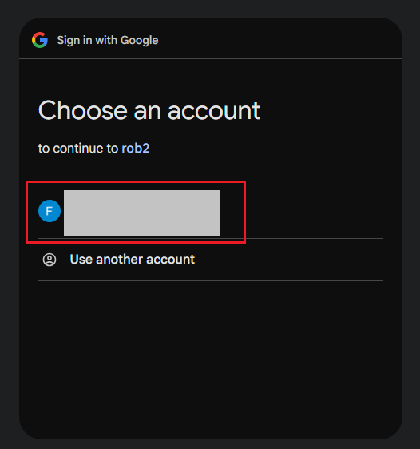

3. After selecting your account, a warning message will appear regarding the execution of the script that implements the spreadsheet's features. To proceed, click **Advanced**:
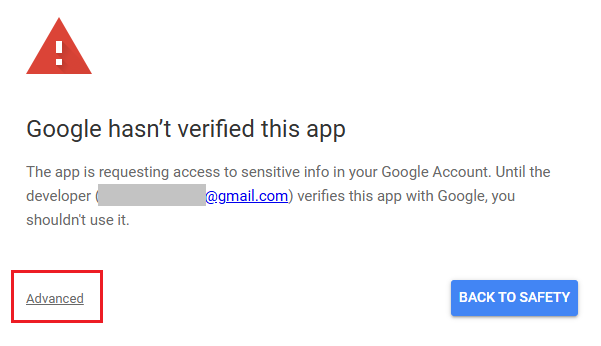

> [!NOTE]
> The warning displayed is a standard message from Google that is displayed for security reasons, similar to the warning displayed before running a Microsoft Excel spreadsheet that contains macros. In this case, there is no reason to worry. The script only accesses the spreadsheet and performs the necessary operations. No other documents or information from your account are collected. The warning only appears by default in all user-customised scripts. To maintain transparency, all source code is publicly available in this repository and can also be viewed in the spreadsheet itself.

4. After clicking Advanced, click **Go to rob2 (unsafe)**:
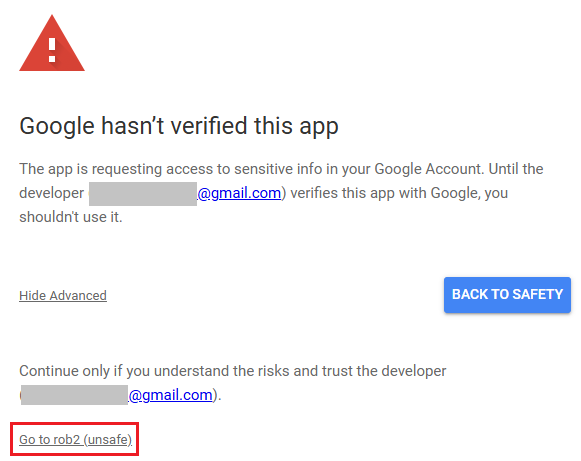

5. On the next screen, you must select the permissions that the script needs to function correctly. Select the **Select all** checkbox and then click the **Continue** button:
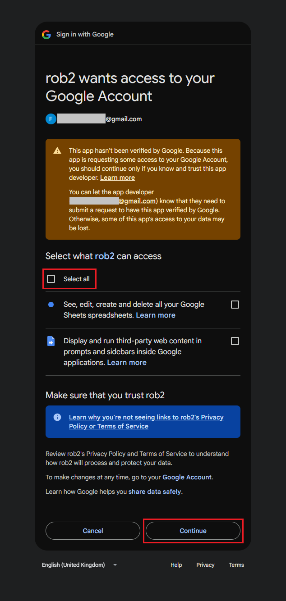

That's it, you now have access to all the spreadsheet's features. Authorisation to run the script is only required on first use.

> [!NOTE]
> At the end of the authorisation process, you will likely receive an automatic email from Google informing you that the script now has access to some of your account data. Again, this is a standard message, and in this case, there is no cause for concern. Google allows users to check which apps have access to their account data at any time and allows users to cancel access at any time.

### Create a new assessment

1. To register a new assessment, you must open the assessment form (by clicking on the *RoB 2 Assessment Form* button in the spreadsheet or in the *RoB 2* menu).
With the form open, select the *New:* option: in the *Assessment ID* selection box at the top of the form, if it is not already selected.

2. Please fill in the information in the fields provided on the tabs. The *Assessment ID* (on *Basic information* tab) field is mandatory, and you cannot use an ID that has already been used. It is important that the *Assessment ID* is unique for each study and outcome being assessed, because when using the Discrepancy Check feature, the spreadsheet checks for records with the same ID on the 'Check' sheet (entered by another assessor).

3. Once you have filled in the details, click the *Save* button.

> [!NOTE]
> - Double-clicking on the signalling question causes guidance on answering the signalling question to appear.
> 
> - RoB 2 incorporates an algorithm to produce risk of bias judgements for each domain, based on the answers to the signalling questions.
> 
> - There is a box that enables you to input a weight for each result. This is set to 1.00 by default (each result has equal weight), but can be edited to reflect the weight given to the result has in the meta-analysis. This is only relevant for the plots created by clicking the *Summary* button on the 'Intro' sheet (explained below). Note that weights should be entered in the same format for all studies (e.g. decimal or percentage).

### Editing existing assessments

There are two ways to edit an existing entry: a) by using the interactive form; or b) by directly editing the sheet Results:

a) Using the interactive form:
 1. In the *Assessment ID* drop-down menu at the top of the form, select the item you wish to edit and the form will be populated.
 2. Make the necessary edits.
 3. Click the *Save* button.

b) Editing sheet results directly:
 1. Find the sheet 'Results'.
 2. Make the necessary edits.

> [!NOTE]
> When editing the 'Results' sheet directly, the suggested risk of bias (algorithm) is not updated automatically. If changes have been made to the answers to the signalling questions, you must reopen the form, select the updated record and click the *Save* button.

### Deleting an existing assessment

You will need to delete an existing assessment in the 'Results' sheet:

1. Find the row corresponding to the assessment you wish to delete in the 'Results' sheet.

2. Delete the whole row.

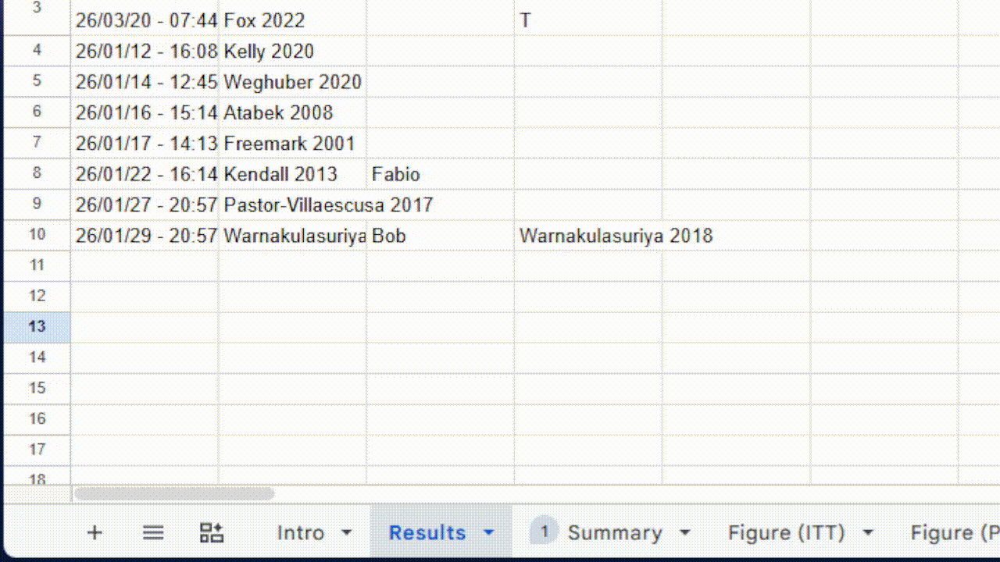

### Creating a summary table and risk of bias graph

This outputs details of each assessment (Assessment ID, Study ID, Reference, Outcome, Result, Weight) plus domain level and overall risk of bias judgements. It also outputs risk of bias graphs that illustrate the proportions of results or information at low risk, some concerns or high risk of bias for each domain.

1. Click the *Summary* button on the 'Intro' sheet;

2. All assessments should appear in the 'Summary' sheet.

3. A plot of the percentage of risk of bias assessments at each level of risk of bias per domain will be displayed on the right-hand side of the sheet. The default setting results in equal weighting for each study (and the plot can be interpreted as showing the proportion of results at each level of risk of bias). If weights have been entered, the plot is weighted by this (and can be interpreted as the proportion of information at each level of risk of bias).

#### Download risk of bias graph

1. Click on the chart; three dots will appear in the top right-hand corner of the chart;

2. Click on the three dots. Under *Download chart*, select the format you want (PNG, PDF or SVG);

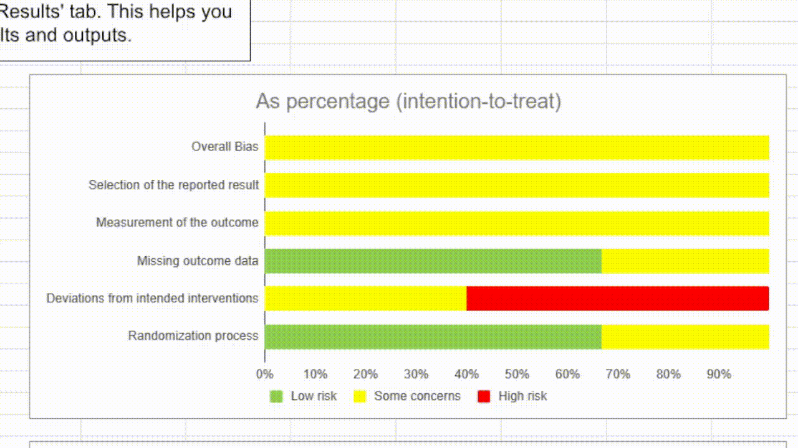

### Risk of bias figures

This outputs Cochrane-style risk of bias figures (“traffic light plots”), which display the domain and overall judgements study-by-study, as shown below. Figures are displayed separately according to effect of interest ('assignment to intervention ' or 'adhering to intervention'). There are two style options for generating the figures: option 1 is similar to the style of the [RoBVis tool](https://www.riskofbias.info/welcome/robvis-visualization-tool) and option 2 follows the traditional style of RoB 2 for Excel.

Option 1:
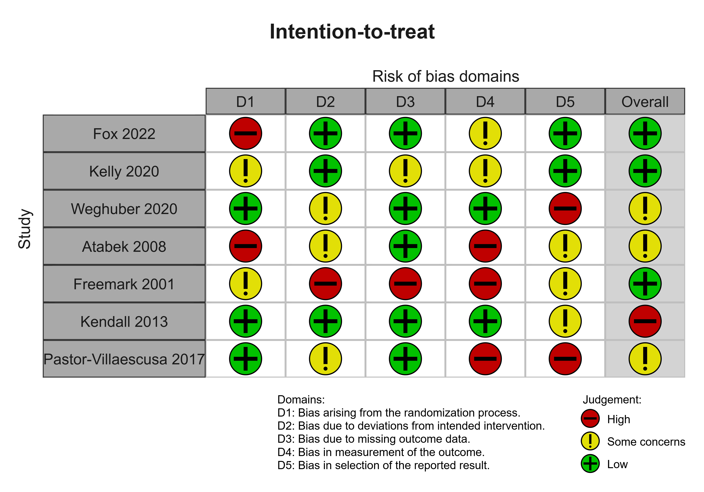

Option 2:

1. Click the 'Figures' button on the 'Intro' sheet or in the *RoB 2* menu.

2. In the window that opens, select the type of figure and which set of results to include, depending on the analysis of interest (intention-to-treat or per-protocol). Download the figure displayed on the screen as a .png file by clicking the *Download* button.

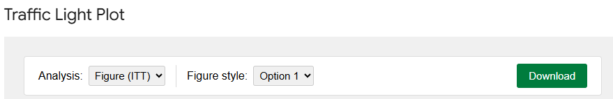

3. Alternatively, the figures will also be generated in the 'Figures (ITT)' or 'Figure (PP)' sheet, depending on the results. In this case, the figures can be edited later, for example by adding borders and lines using the standard Google Sheets functions. They can be downloaded in PDF format.

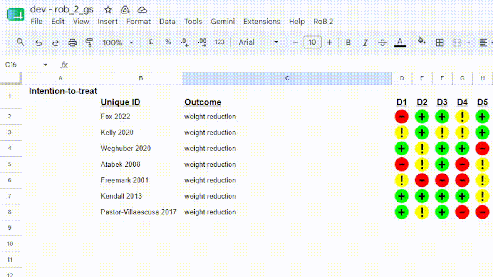

> [!NOTE]
> Change the order in which the studies appear in the figures by sorting the columns in the 'Summary' sheet.

### Populating results for printing

This outputs the full results for each study assessment, including the answers to signalling questions and the justifications given for answers, into a template. This may facilitate double-checking or allow the creation of supplementary materials for publications.

1. Click the 'Generating a Print View' button on the 'Intro' sheet or in the *RoB 2* menu.

2. Results will be copied and pasted in the 'Print (ITT)' or ‘Print (PP)’ sheets.

3. After clicking to view the required sheet ('Print (ITT)' or 'Print (PP)'), go to the *File* menu an then *Download* to select the format. When selecting *PDF (.pdf)*, you can adjust the page break settings, page orientation and other options.

> [!NOTE]
> Change the order in which the studies appear in the figures by sorting the columns in the 'Results' sheet.

## License

Licensed under Creative Commons Attribution-NonCommercial-ShareAlike 4.0 International (CC BY-NC-SA 4.0). See [LICENSE.md](LICENSE.md) for more informations.